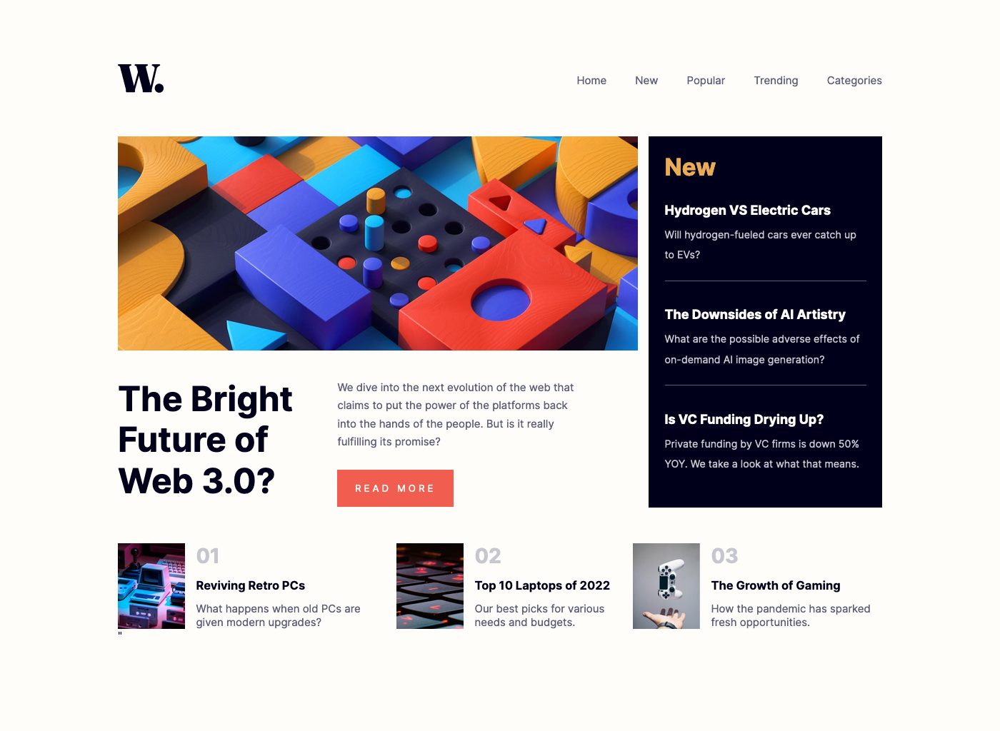

# Frontend Mentor - News homepage solution

This is a solution to the [News homepage challenge on Frontend Mentor](https://www.frontendmentor.io/challenges/news-homepage-H6SWTa1MFl). Frontend Mentor challenges help you improve your coding skills by building realistic projects. 

## Table of contents

- [Overview](#overview)
  - [The challenge](#the-challenge)
  - [Screenshot](#screenshot)
  - [Links](#links)
- [My process](#my-process)
  - [Built with](#built-with)
  - [What I learned](#what-i-learned)
  - [Continued development](#continued-development)
  - [Useful resources](#useful-resources)

## Overview

### The challenge

Users should be able to:

- View the optimal layout for the interface depending on their device's screen size
- See hover and focus states for all interactive elements on the page

### Screenshot

### Links

- Solution URL: [https://github.com/annapmarin/news-homepage](https://github.com/annapmarin/news-homepage)
- Live Site URL: [https://annapmarin.github.io/news-homepage](https://annapmarin.github.io/news-homepage)

## My process

### Built with

- Semantic HTML5 markup
- CSS custom properties
- Flexbox
- JavaScript (vanilla)

### What I learned

I improved my CSS and JavaScript abilities learning to display the menu bar (for mobile devices).

### Continued development

It would be interesting to see if I can rebuild the project with some JavaScript framework as React or Vue.

### Useful resources

- [Disable scroll with JS](https://www.miguelra.com/deshabilitar-scroll-con-javascript/) - This helped me because I could not disable scroll with "overflow: hidden" for design reasons, but with this method I found the solution to the issue.

- [Some reaserch on applying JS to pseudoelements](https://stackoverflow.com/questions/9395858/event-listener-on-a-css-pseudo-element-such-as-after-and-before) - This is one of the pages I consulted to find if I could apply JS to pseudo elements as ::before or ::after, due to the fact that at first the icon of "menu-close" or the black layer when the menu is opened were pseudo elements. Finally I changed them for elements with "display: none", adding "display: block" with JS.